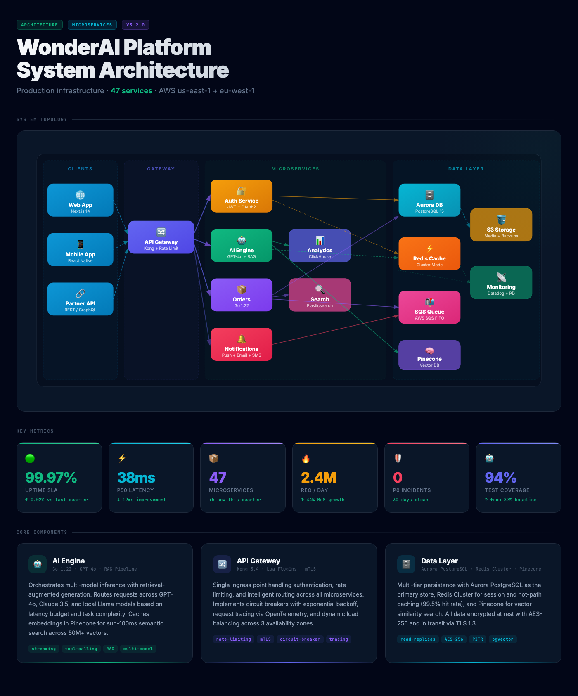
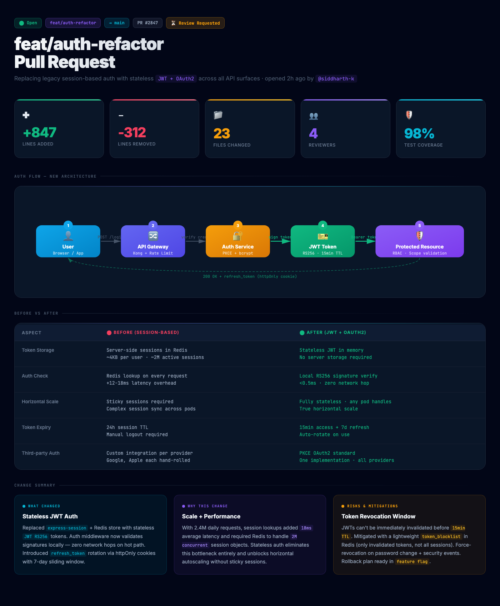
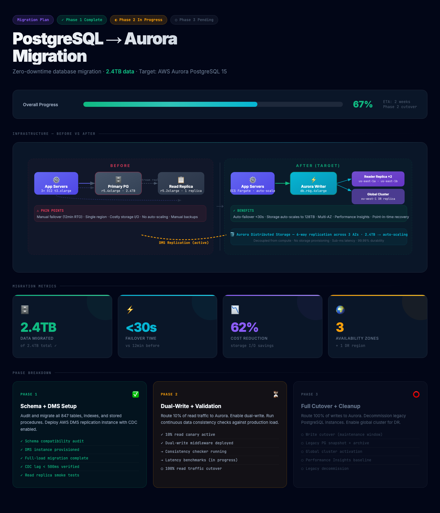

# engineering-doc-generator

> A Claude AI skill that generates polished, dark-themed HTML explainer documents for any engineering artifact.



---

## Screenshots

### System Architecture — Microservices Overview
A stunning full-width architecture diagram with gradient-filled service nodes, data flow arrows, 6 stat tiles, and component highlight cards. 1400px wide, zero sidebar.


### Pull Request Explainer — feat/auth-refactor
Wide PR explainer with stat tiles (+847/−312 lines, 98% coverage), an animated auth flow sequence diagram, before/after comparison table, and color-coded change callouts.



### Database Migration Plan — PostgreSQL → Aurora
Migration progress page with phase chips, a side-by-side before/after infrastructure SVG, 67% progress bar, stat tiles, and a 3-phase breakdown.



---

## What it produces

A **single self-contained HTML file** — not a dashboard, not a wiki page, but a document-first explainer that works for both engineers and non-engineers. Features:

- 🌑 **Dark theme** — `#020617` base, full CSS variable system
- 🗂 **Sidebar navigation** — hash-based, one section visible at a time
- 📊 **Stat tiles** — real numbers only, every stat cited to its source command
- 🔷 **Inline SVG diagrams** — architecture, sequence flows, before/after comparisons
- 🎨 **Color-coded callouts** — success/info/warning/error variants
- 🌲 **Annotated file trees** — new/modified/deleted files highlighted
- 💻 **Syntax-colored code blocks** — no external highlighter needed
- 📱 **Mobile-tolerant** — sidebar collapses below 900px, all sections stack

---

## Install

### Claude.ai (Pro+)

1. Download [`engineering-doc-generator.zip`](https://github.com/ktech99/engineering-doc-generator/raw/main/engineering-doc-generator.zip)
2. Open [claude.ai](https://claude.ai) → Settings → **Skills**
3. Click **+ Add** and upload the zip

### Claude Code / Cursor / Windsurf

Copy `SKILL.md` into your skills directory:

```bash
# Claude Code
mkdir -p ~/.claude/skills/engineering-doc-generator
curl -o ~/.claude/skills/engineering-doc-generator/SKILL.md \
  https://raw.githubusercontent.com/ktech99/engineering-doc-generator/main/SKILL.md
```

---

## Example prompts

```
Generate an HTML explainer for this PR
```

```
Document the architecture of this repo as a webpage
```

```
Make a visual brief of this migration plan
```

```
Turn this post-mortem into a doc the team can read
```

```
Generate an explainer for branch feat/payments — audience is product managers
```

---

## How it works

The skill:

1. **Discovers context** — runs `git log`, `git diff`, `gh pr view`, `find`, `wc -l` to gather real data
2. **Picks sections** — scales the outline to the topic. A PR gets ~5 sections. A full architecture gets up to 17.
3. **Backs every stat** — no invented numbers. If a stat can't be sourced, it's omitted.
4. **Generates one HTML file** — fully self-contained. One Google Fonts `<link>`, everything else inline.
5. **Saves to** `docs/explainers/<subject-slug>.html` by default.

---

## Artifact types supported

| Artifact | Typical sections |
|---|---|
| Pull request | TL;DR, File tree, Flow, Components, Tests |
| Repo architecture | Full 17-section layout |
| Migration plan | TL;DR, Big picture, Flow, Inputs/outputs, Operational |
| Post-mortem | TL;DR, Timeline, Root cause, Bugs fixed, What's deferred |
| System design | Big picture, Components, Data model, API surface, Contracts |
| Roadmap | TL;DR, Phases, Decisions, Open questions |

---

## Compatibility

Works with:
- **Claude.ai** (Pro+) — via Skills upload
- **Claude Code** — place `SKILL.md` in `~/.claude/skills/`
- **Cursor** — place in `.cursor/skills/` or configure in settings
- **Windsurf** — place in `.windsurf/skills/`
- **OpenClaw** — auto-discovered from `skills/` workspace directory

---

## License

MIT © 2026
